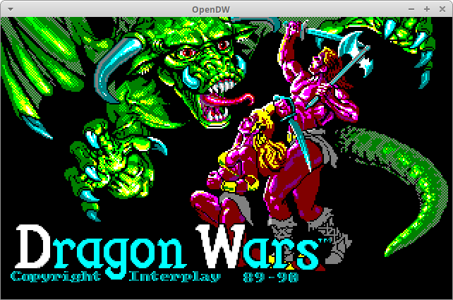

# OpenDW
A game engine for Interplay's 1989/1990 Dragon Wars game.
Original data files are required.
This game was originally written in x86 assembly language. OpenDW is an
attempt to port this game to modern environments using the C language.

Original game engine by [Rebecca Ann Heineman](http://www.burgerbecky.com/).

This game can be purchased at [GOG](https://www.gog.com/game/dragon_wars).

# Prerequisites
- Executable (DRAGON.COM).
- Original data files (DATA1 and DATA2).
- SDL2.

Under Linux/Unix operating systems, this engine expects that the original game
files should be all lowercase (e.g. DRAGON.COM -> dragon.com).

# Screenshot

